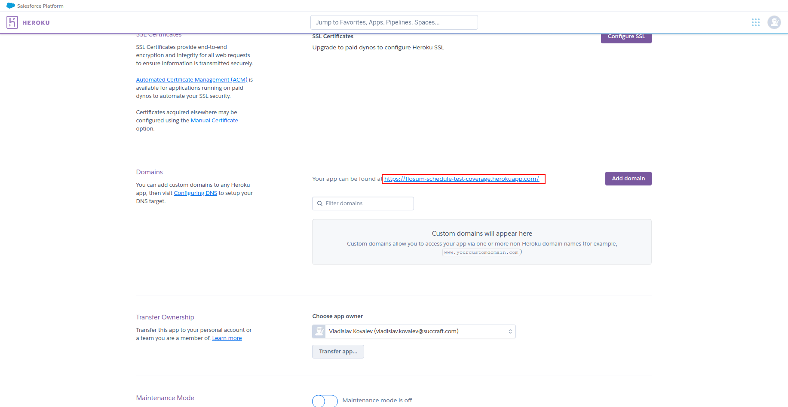

# Test Coverage
## Deployment:

## How to configure Test Coverage

#### Step 1: Creating the Heroku application
Go to the GitHub account provided by your Customer Success team. 
Go to the repository “test-coverage”. 
Click the button "Deploy to Heroku" to deploy the application to Heroku. (See Fig. 1.) 

Fig. 1

 
Enter application name  you want to give to this Heroku app and click the button “Deploy app”.
 

 

 Fig. 2

 
This should result in the successful deployment of the code in the GitHub repository to the Heroku app. 
 
#### Step 2: Creating “Named Credentials”
In Heroku, select Name app. Next go to the application settings page and copy the domain. (See Fig. 3.) 

Fig. 3

 
Now in Flosum select the Setup Gear. In the Quickfind box, search for "Named Credenitals". Then you will add a new Named Credential. Name : Flosum_Test_Coverage.  The URL is the domain that you just copied from Heroku. (See Fig. 4.) 

Fig. 4
